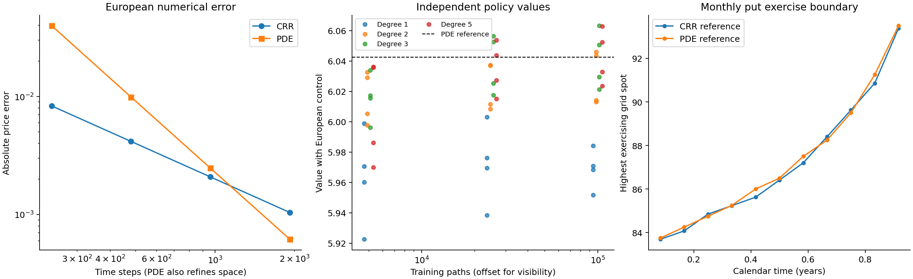
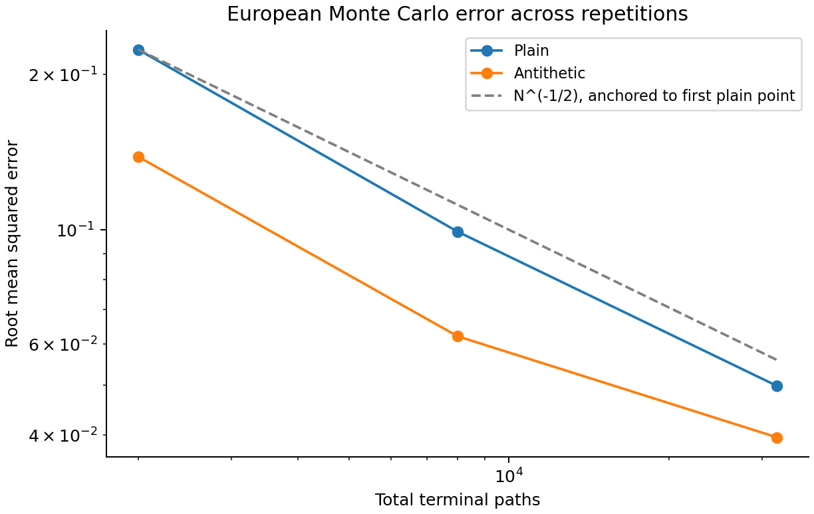

# Preliminary numerical validation record

**Stage 1 prototype. These are mathematical test fixtures and model simulations, not observed market data or empirical research findings.** The inputs are analytically specified to check implementation. The market-data study is still to be developed under the research design.

Generated by the benchmark command from the saved configuration. Prices are in the same arbitrary currency units as spot and strike. Simulated paths follow risk-neutral geometric Brownian motion.

## Contract and numerical references

The put has spot 100, strike 100, maturity 1 year(s), rate 5.0%, volatility 20.0%, dividend yield 0.0% and 12 equally spaced positive exercise dates. Exercise at time zero is excluded.

| Reference | Value |
| --- | ---: |
| European analytical | 5.57352602 |
| Bermudan CRR, 7680 steps | 6.04266876 |
| Bermudan PDE, 1600 space intervals and 3840 time steps | 6.04265205 |

The two Bermudan references differ by 0.000017. This is evidence of numerical agreement, not a certified error bound. The largest domain-check difference at fixed spot spacing is 0.

## Refinement

| Method | Space intervals | Time steps | European error | Bermudan difference from fine PDE |
| --- | ---: | ---: | ---: | ---: |
| CRR | 0 | 240 | -0.008328 | -0.002524 |
| CRR | 0 | 480 | -0.004165 | -0.001793 |
| CRR | 0 | 960 | -0.002083 | -0.000851 |
| CRR | 0 | 1920 | -0.001041 | -0.000331 |
| PDE | 100 | 240 | -0.039821 | -0.038173 |
| PDE | 200 | 480 | -0.009899 | -0.009841 |
| PDE | 400 | 960 | -0.002471 | -0.002157 |
| PDE | 800 | 1920 | -0.000618 | -0.000474 |

CRR space resolution is determined by its time step; zero in its space column means no separate spatial-grid input. The PDE refinement above changes both space and time, so it does not isolate their individual orders.

## Policy approximation

Every row below averages independently trained policies across the configured repetitions. Within each repetition, all policies share one independent evaluation sample. Configurations were specified before this run; these results do not select a winning configuration for a further performance claim.

| Training paths | Degree | Mean policy value | Mean difference from PDE | SD of repeated values | Mean training seconds |
| --- | ---: | ---: | ---: | ---: | ---: |
| 5000 | 1 | 5.963048 | -0.079604 | 0.031592 | 0.004 |
| 5000 | 2 | 6.016192 | -0.026460 | 0.017295 | 0.003 |
| 5000 | 3 | 6.015709 | -0.026943 | 0.015448 | 0.004 |
| 5000 | 5 | 6.007001 | -0.035651 | 0.034126 | 0.004 |
| 25000 | 1 | 5.971794 | -0.070858 | 0.026503 | 0.015 |
| 25000 | 2 | 6.023541 | -0.019111 | 0.015784 | 0.017 |
| 25000 | 3 | 6.037952 | -0.004700 | 0.019453 | 0.017 |
| 25000 | 5 | 6.034894 | -0.007758 | 0.017237 | 0.019 |
| 100000 | 1 | 5.968755 | -0.073897 | 0.013360 | 0.062 |
| 100000 | 2 | 6.029122 | -0.013530 | 0.018020 | 0.064 |
| 100000 | 3 | 6.041093 | -0.001559 | 0.019237 | 0.068 |
| 100000 | 5 | 6.042876 | +0.000224 | 0.017995 | 0.075 |

Values use a fixed European control variate. Individual raw estimates, sampling standard errors, approximate 95% intervals, seeds, regression conditioning and exercise fractions are in `policy_evaluation.csv`. Those intervals concern evaluation noise conditional on a fitted policy. The repeated-value standard deviation includes both new training and new evaluation samples and does not isolate training variability.

A policy's population value cannot exceed the optimal value for this model and calendar. A finite sample estimate can exceed a numerical reference. Consequently a negative estimated shortfall is not evidence of beating the optimum, and these computations do not certify policy loss.

## Monte Carlo

| Paths | Sampling | RMSE | Interval coverage | Repetitions |
| ---: | --- | ---: | ---: | ---: |
| 2000 | Plain | 0.223627 | 90.0% | 40 |
| 8000 | Plain | 0.099188 | 90.0% | 40 |
| 32000 | Plain | 0.049800 | 92.5% | 40 |
| 2000 | Antithetic | 0.138622 | 95.0% | 40 |
| 8000 | Antithetic | 0.062170 | 97.5% | 40 |
| 32000 | Antithetic | 0.039585 | 90.0% | 40 |

Coverage is an empirical fraction across a modest number of repetitions, not a guarantee. Antithetic uncertainty uses independent pair averages. The reference slope follows the finite-variance Monte Carlo rate; three sample sizes do not establish an asymptotic convergence theorem.

## Exercise opportunities and economic mechanisms

| Exercise dates | Value | Difference from analytical European |
| ---: | ---: | ---: |
| 1 | 5.573372 | -0.000154 |
| 4 | 5.956493 | 0.382967 |
| 12 | 6.042652 | 0.469126 |
| 48 | 6.077993 | 0.504466 |

These are different contracts. Additional exercise dates expand the feasible set of stopping rules. Their value differences must not be described as Monte Carlo or regression error. The one-date PDE difference from the analytical value measures numerical error.

| Rate | Volatility | European value | Monthly Bermudan value | Early-exercise premium |
| ---: | ---: | ---: | ---: | ---: |
| 0.0% | 10.0% | 3.987761 | 3.987450 | -0.000311 |
| 0.0% | 20.0% | 7.965567 | 7.965414 | -0.000154 |
| 0.0% | 40.0% | 15.851942 | 15.851868 | -0.000074 |
| 2.0% | 10.0% | 3.036848 | 3.205753 | 0.168905 |
| 2.0% | 20.0% | 6.935905 | 7.089982 | 0.154078 |
| 2.0% | 40.0% | 14.724285 | 14.874279 | 0.149995 |
| 5.0% | 10.0% | 1.927900 | 2.394587 | 0.466687 |
| 5.0% | 20.0% | 5.573526 | 6.042652 | 0.469126 |
| 5.0% | 40.0% | 13.145894 | 13.612960 | 0.467066 |
| 10.0% | 10.0% | 0.791893 | 1.559417 | 0.767524 |
| 10.0% | 20.0% | 3.753418 | 4.730137 | 0.976718 |
| 10.0% | 40.0% | 10.802211 | 11.857058 | 1.054847 |

For the non-dividend-paying put, exercise exchanges exposure to future stock movements for receipt of the strike less the current stock value. Positive interest rates make earlier receipt of the strike attractive, while preserving the option retains downside protection and convexity. Changing volatility affects the value of that protection. The premium therefore requires joint analysis of timing and uncertainty; it is not inferred from the European vega alone.

At zero rates and zero dividends, Jensen's inequality for the convex payoff of a martingale implies no benefit from early exercise. Small negative premiums against the analytical European benchmark here are discretisation residuals, not economic losses from having more rights.

## What this establishes and what remains

This prototype provides a reproducible numerical check under one diffusion model, a test contract and controlled sensitivities. It provides preliminary evidence for implementation accuracy. It does not establish a universally best regression basis, continuous-time American value, martingale dual bounds, market calibration, hedging performance or a completed research contribution.

Next experiments should isolate time and space refinement, add more independent training repetitions, evaluate policy differences using paired cash flows, measure loss with validated dual bounds, and test stress cases before adding model complexity.

Run environment: Python 3.13.9, Apple M2, macOS-26.6.2-arm64-arm-64bit-Mach-O. Total measured runtime: 6.2 seconds. Per-method timings are single-process wall-clock observations on this machine; they include no peak-memory measurement. Dependency versions, source hashes and random-stream roles are recorded in `manifest.json`.
